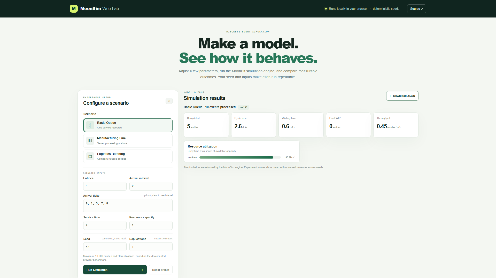

# MoonSim

[](https://github.com/jhg20070623-ai/moonsim/actions/workflows/ci.yml)
[](https://github.com/jhg20070623-ai/moonsim/releases/latest)
[](LICENSE)

A lightweight, reproducible discrete-event simulation engine written in MoonBit.

**[▶ Try MoonSim Web Lab](https://jhg20070623-ai.github.io/moonsim/)** · [Source](https://github.com/jhg20070623-ai/moonsim) · [Documentation](docs/architecture.md)



[View the short Web Lab demo (GIF)](docs/images/moonsim-demo.gif) · [Browser compatibility results](docs/browser-compatibility.md)

MoonSim targets manufacturing, logistics, queueing, and process simulation. The current core provides a monotonic integer-tick clock, validated event actions, a stable priority queue, a scheduler with `run()` and `run_until()`, capacity-limited resources with utilization tracking, a generic FIFO queue with waiting-time statistics, route-following entities, fixed-time/fixed-count/hybrid batch policies, a reproducible seeded random stream, and metrics for cycle time, waiting time, WIP, throughput, and queue length.

## Features

- Integer-tick simulation clock and deterministic event ordering.
- Capacity-limited resources and generic FIFO queues with waiting statistics.
- Entities that follow reusable named routes.
- Fixed-time, fixed-batch, and hybrid batch trigger policies.
- Seeded random values and collection of cycle time, waiting time, WIP, throughput, and queue length.

The core stays composable; the Web Lab wraps three parameterized example models. It does not provide a graphical model editor or a workflow designer.

## MoonSim Web Lab

The browser lab lets you change queueing, manufacturing, and batching inputs, run the MoonBit scenarios, view returned KPIs, compare the three logistics release policies, and download the request and actual result as JSON. A seed can be repeated directly; the Experiment Runner summarizes consecutive seeded replications with mean and observed min/max. Browser work runs in a Web Worker.

**Live demo:** [MoonSim Web Lab](https://jhg20070623-ai.github.io/moonsim/)

The browser adapter limits each run to 10,000 entities and each experiment to 20 replications. The measurements and test machine are documented in [browser limits](docs/browser-limits.md).

## Quick start

Create a simulation with @moonsim.Simulation::with_seed(42), schedule actions, and call run(). For a complete queueing model, run:

    moon run examples/basic_queue

To build and serve the browser lab locally, build its MoonBit JavaScript module and static files, then serve the generated `site/` directory:

```sh
moon build --target js web_api
node scripts/build-web.mjs
python -m http.server 8000 --directory site
```

Open <http://localhost:8000>. GitHub Actions builds the same static package and deploys it to Pages from `main` after validation.

## Architecture

The scheduler owns the simulation clock and stable event heap. Event actions update resource, queue, entity, and metrics state at integer timestamps. Models are composed by scheduling actions; MoonSim does not hard-code a particular production line or logistics process.

## Deterministic simulation

Simulation time uses integer ticks, and event ordering uses timestamp, priority, insertion sequence, and event ID. Use `Simulation::with_seed(seed)` for a repeatable random stream. See [reproducibility notes](docs/reproducibility.md) for the exact guarantee.

## Examples

- [Basic queue](examples/basic_queue/README.md): arrivals, FIFO waiting, one capacity-limited machine, service completion, and collected metrics.
- [Manufacturing line](examples/manufacturing_line/README.md): 20 entities routed through seven capacity-limited stations.
- [Logistics batching](examples/logistics_batching/README.md): a measured comparison of fixed-time, fixed-batch, and hybrid releases.
- See the [roadmap](docs/roadmap.md) and [historical case-study background](docs/case-study-background.md).

## Build and test

Install the MoonBit toolchain from [moonbitlang.com](https://www.moonbitlang.com/download), then run from the repository root:

```sh
moon fmt
moon check
moon test
moon build --target js web_api
node web_api/smoke.mjs
node scripts/build-web.mjs
node scripts/site-smoke.mjs
moon run cmd/main
```

The cross-browser Web Lab suite uses Playwright. After installing Node.js 24, run:

```sh
npm ci
npx playwright install chromium
npm run test:browser
```

The Chromium suite runs each Web Lab scenario, checks rendered KPIs and JSON downloads, verifies responsive width, and confirms that changed inputs trigger a new result. To run the advisory Firefox suite locally, install Firefox with `npx playwright install firefox` and run `npm run test:browser:firefox`. If Microsoft Edge is installed, `node scripts/browser-smoke.mjs edge chromium firefox` compares the default manufacturing results across all three browsers. See [browser test results and scope](docs/browser-compatibility.md).

## License

MoonSim is licensed under Apache-2.0. See [LICENSE](LICENSE).
